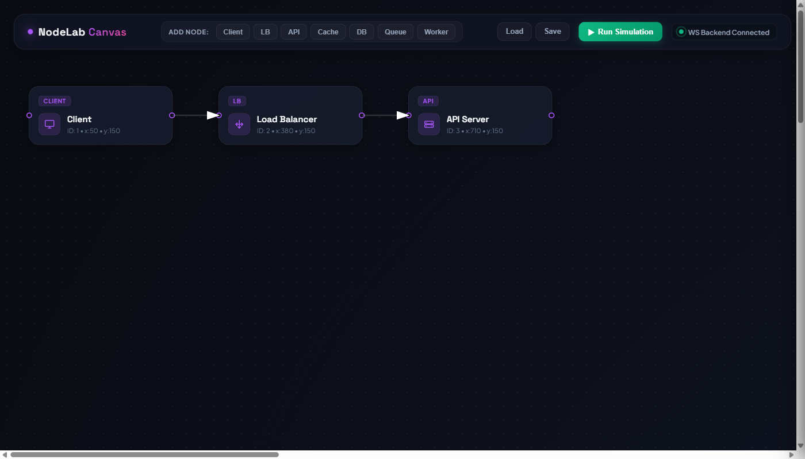
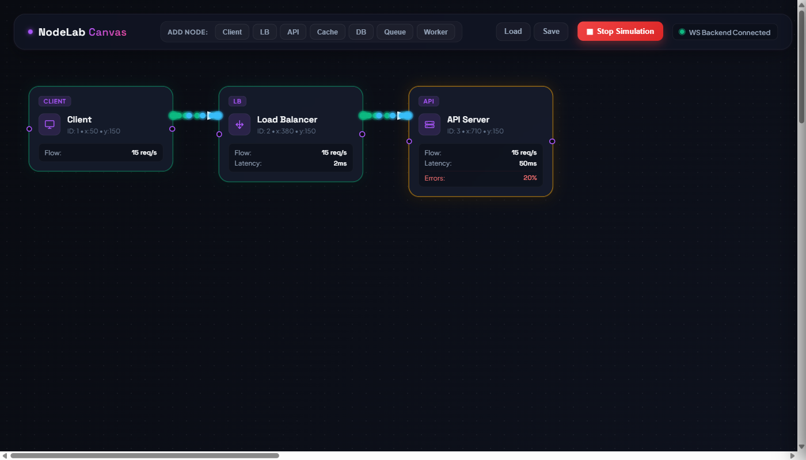
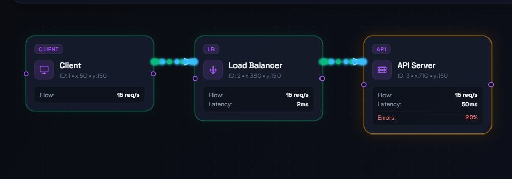

# 🎨 NodeLabCanvas

> **Design. Simulate. Learn.**  
> An interactive distributed system design playground built with **Angular** and **Django Channels** that allows you to visually orchestrate architectures, simulate real-time traffic flow, and observe system behavior and bottlenecks dynamically.

---

<p align="center">
  
  
  
  
  
</p>

---

## 📸 Screenshots & Interactive Demo

Experience the platform in action! Below are visual walkthroughs of the canvas, system simulation, and node analytics.

### 1. Architectural Canvas Setup
*Create complex system architectures using drag-and-drop nodes, customized connections, and intuitive design controls.*
<p align="center">
  
</p>

### 2. Live Request Flow Simulation
*Watch request packets flow dynamically as animated particles tracing connections between clients, load balancers, and services in real time via WebSockets.*
<p align="center">
  
</p>

### 3. Detailed Node Analytics & Close-up
*Monitor live performance metrics—including latency, error rate, throughput, and state changes—directly on system components.*
<p align="center">
  
</p>

---

## ✨ Core Features

*   **Interactive Visual Designer**: Drag, drop, and connect distributed components. Move nodes freely on an infinite canvas with automatic layout saving/loading.
*   **Packet Flow Simulation**: Real-time traffic generators simulate concurrent clients sending requests through load balancers to backend services.
*   **WebSocket Engine**: Instant backend-to-frontend synchronization for node state updates, failure alerts, and request-flow animation.
*   **Dynamic Metrics Dashboard**: Graph-based latency calculation, bottleneck checking, database load visualization, and cache hit/miss ratio metrics.
*   **Fault Tolerance Playground**: Terminate or scale nodes on-the-fly during active simulations and observe system adaptation.

---

## 🏗️ Supported Components

| Component | Visual Representation | Purpose & Simulation Logic |
| :--- | :---: | :--- |
| **Client** | 💻 | Traffic source generating request load at customized intervals |
| **Load Balancer** | ⚖️ | Distributes traffic to API servers using algorithms (Round Robin, Least Connections) |
| **API Server** | ⚙️ | Processes requests, performs calculations, and coordinates with Cache/DB |
| **Cache** | ⚡ | Speeds up read throughput; simulates hit/miss latencies based on hit rate config |
| **Database** | 🗄️ | Stores persistent state; simulates connection pools, query queues, and disk latency |
| **Message Queue** | 📥 | Buffers requests asynchronously to protect downstream systems from spikes |
| **Background Worker** | 👷 | Consumes jobs from the Queue, processing them with adjustable throughput limits |
| **WebSocket Server** | 🔌 | Manages persistent real-time connections to keep simulation visual feeds fluid |

---

## 🛠️ Tech Stack

### Frontend
*   **Framework**: Angular 19 (TypeScript)
*   **State & Flow Management**: RxJS & Angular Signals
*   **Canvas & Interaction**: Angular CDK Drag and Drop, Custom SVG Connectors
*   **Styles**: Tailwind CSS

### Backend
*   **Framework**: Django 6.0 (Django REST Framework)
*   **Asynchronous Protocol**: Django Channels (ASGI)
*   **Server**: Daphne

### Storage & Real-Time (Future Roadmap)
*   **Database**: SQLite (Development) / PostgreSQL (Production)
*   **Broker**: Redis (Simulations, queues, and channel layer backup)

---

## 📂 Project Structure

```text
NodeLabCanvas
├── PlaygroundBackend/                 # Django ASGI Application
│   ├── PlaygroundBackend/             # Project Settings, URLs, and ASGI Routing
│   ├── playground/                    # Main logic app (Models, Views, Consumers)
│   ├── screenshots/                   # Backup folder for visual assets
│   ├── db.sqlite3                     # Local development DB
│   └── manage.py                      # Django CLI Entry point
│
├── PlaygroundFrontend/
│   └── system-design-playground/      # Angular SPA
│       ├── src/
│       │   ├── app/                   # Core/Shared services, Canvas components, Nodes
│       │   ├── assets/                # Local icons, themes, styles
│       │   └── index.html             # Application shell
│       ├── package.json               # Node dependencies
│       └── angular.json               # Angular compilation configuration
│
└── screenshots/                       # Main repository visual assets (linked in README)
```

---

## ⚡ Getting Started

### Prerequisites
*   **Python** 3.10 or higher
*   **Node.js** v18 or higher (along with `npm`)
*   **Angular CLI** (optional, standard npm scripts are provided)

---

### 1. Backend Setup (Django Channels)

Navigate to the backend directory, set up your virtual environment, and install dependencies:

```bash
cd PlaygroundBackend

# Create and activate virtual environment
python -m venv playgroundEnv
# On Windows (PowerShell)
.\playgroundEnv\Scripts\Activate.ps1
# On Linux/macOS
source playgroundEnv/bin/activate

# Install requirements
pip install -r requirements.txt

# Run migrations
python manage.py migrate

# Start the Daphne dev server
python manage.py runserver
```

The Django ASGI/Daphne server will spin up on `http://127.0.0.1:8000`.

---

### 2. Frontend Setup (Angular)

In a new terminal window, navigate to the frontend directory, install dependencies, and run the development server:

```bash
cd PlaygroundFrontend/system-design-playground

# Install npm packages
npm install

# Start the Angular CLI development server
npm run start
```

Open your browser and navigate to `http://localhost:4200` to view the interactive playground.

---

## 🎯 Project Roadmap & MVP Status

### Phase 1: Core Drag-and-Drop Canvas 🏁 (Completed)
- [x] Node drag-and-drop grid system
- [x] Fully responsive connection paths between nodes
- [x] Dynamic canvas save/load layout states to the backend

### Phase 2: Asynchronous Simulation Engine 📈 (Completed)
- [x] Backend-calculated request flow simulation
- [x] Live WebSocket channels transmitting latency/throughput metrics
- [x] Real-time request particle animations flowing along paths

### Phase 3: Advanced Nodes & Policies 🚧 (In Progress)
- [ ] Database Connection Pool simulation
- [ ] Redis Cache TTL expiration and LRU/LFU eviction visualizations
- [ ] Load balancer routing strategies configuration (Round Robin vs Weighted Least Connection)

### Phase 4: Production-Grade Enhancements 🔮 (Future)
- [ ] Deploying simulation brokers to Redis Channel Layers
- [ ] Custom system architecture template cataloging
- [ ] Multiuser synchronized editing & multiplayer classroom sandbox

---

## 💡 Why NodeLabCanvas?

While text-based guides and static architecture diagrams are highly informative, they lack hands-on responsiveness. **NodeLabCanvas** bridges this gap:
*   Allows developer learners to experiment with system configurations risk-free.
*   Enables testing of visual architectures under traffic spikes, showcasing how load balancers redirect resources or queues fill up.
*   Acts as a visual debugger for system planning.

---

## 🤝 Contributing

We welcome suggestions, feedback, and contributions! Feel free to open an issue or submit a pull request.

⭐ **If you find this project helpful or interesting, please give it a star!**